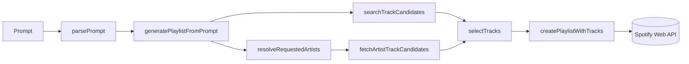

# spotify-playlist-skill

Generate Spotify playlists from natural-language prompts with a local TypeScript CLI and a repo-local Cursor/OpenClaw skill.

## Why This Project Matters

Playlist creation is still manual for many event and mood-based use cases. This project focuses on a practical product workflow:

- describe a playlist in plain language
- resolve intended artists and constraints
- generate a usable Spotify playlist in one command

The goal is a reliable builder tool, not just a code demo.

## What It Does

`spotify-playlist-skill` turns prompts like:

- `Make me a 20-song chill Brazilian night drive playlist.`
- `Create a 45-minute gym playlist with rap and electronic music.`
- `Build a study playlist with calm piano and no explicit songs.`
- `Create a Spotify playlist called Pecuária 2026 with Matheus e Kauan, Simone Mendes, Fred e Fabrício, and Alok.`

into real Spotify playlists using your own Spotify account and app credentials.

## Features

- Natural-language parsing for playlist name, song count, duration, mood, genre, and clean-only requests
- Explicit artist extraction from both structured and freeform prompts
- Multi-artist balancing so requested artists are all represented
- Spotify OAuth bootstrap with local token persistence
- SDK-backed Spotify integration via `spotify-web-api-node`
- Local CLI workflow plus a repo-local Cursor/OpenClaw skill
- Focused tests for parsing, selection, and artist filtering logic

## Requirements

- Node.js 20+
- npm
- A Spotify account
- Your own Spotify Developer app credentials

## Spotify App Setup

1. Go to the [Spotify Developer Dashboard](https://developer.spotify.com/dashboard).
2. Create an app.
3. Set the redirect URI to:

```text
http://127.0.0.1:8888/callback
```

4. Enable `Web API`.
5. Copy your `Client ID` and `Client Secret`.

## Environment Variables

Copy `.env.example` to `.env`.

PowerShell:

```powershell
Copy-Item .env.example .env
```

macOS/Linux:

```bash
cp .env.example .env
```

Then fill in your real values in `.env`.

Example template:

```env
SPOTIFY_CLIENT_ID=your_spotify_client_id
SPOTIFY_CLIENT_SECRET=your_spotify_client_secret
SPOTIFY_REDIRECT_URI=http://127.0.0.1:8888/callback
SPOTIFY_DEFAULT_MARKET=BR
SPOTIFY_TOKEN_PATH=.spotify-playlist-skill.tokens.json
```

## Installation

```bash
npm install
```

## Usage

Authorize once:

```bash
npm run auth
```

Generate a playlist:

```bash
npm run generate -- "Create a 45-minute gym playlist with rap and electronic music"
```

Run the smoke prompt:

```bash
npm run smoke
```

## Example Output

```text
Playlist: Pecuária 2026
Tracks: 50
Duration: 152.4 min
URL: https://open.spotify.com/playlist/7xDYjsVNiaKQ7CWmTTQZWm
```

## Cursor / OpenClaw Usage

This repo also includes a local skill at `.cursor/skills/spotify-playlist/SKILL.md`.

Once the repo is open in Cursor, you can ask in chat:

- `Create me a 20-song chill Brazilian night drive playlist`
- `Make a playlist of classic rock songs. 50 songs, I really like the Eagles, Pink Floyd, Led Zeppelin, and Robert Plant.`

## Project Structure

```text
src/
  application/   playlist generation orchestration
  domain/        prompt parsing, filtering, and selection rules
  spotify/       auth, search, and playlist adapters
tests/           prompt and track selection tests
.cursor/skills/  repo-local skill instructions
```

## Architecture

The project keeps custom logic in the domain/application layers and pushes Spotify SDK calls behind a thin gateway:

- `src/domain/parse-prompt.ts`: prompt interpretation
- `src/domain/select-tracks.ts`: query building, filtering, balancing, and ranking
- `src/spotify/auth.ts`: OAuth flow, refresh, and token persistence
- `src/spotify/search.ts`: Spotify search and artist resolution helpers
- `src/spotify/playlists.ts`: playlist creation and item insertion



## Quality Checks

```bash
npm run check
```

## Security

- Do **not** commit `.env`
- Do **not** commit `.spotify-playlist-skill.tokens.json`
- Do **not** share your real Spotify client secret
- This repo should only publish `.env.example` with placeholder values

If your client secret was exposed during development, rotate it in the Spotify Developer Dashboard before publishing.

## Limitations

- The parser is still heuristic, not a full LLM planner
- “Likely live songs” is approximated through Spotify search and popularity signals, not official live setlists
- The tool creates private playlists by default
- Results depend on Spotify’s current catalog, market availability, and API behavior

## Roadmap

- Improve artist canonicalization and representation reporting
- Add optional setlist-aware enrichment (external data source)
- Add playlist sequencing modes (`warmup`, `peak-energy`, `cooldown`)
- Add integration tests with mocked Spotify responses
- Add release tags and changelog for reproducible versions

## Publishing

This repo is designed so other people can use it with their own Spotify app credentials. After cloning, they should:

1. Run `npm install`
2. Copy `.env.example` to `.env`
3. Add their own Spotify credentials
4. Run `npm run auth`
5. Run `npm run generate -- "<their prompt>"`

## License

MIT
